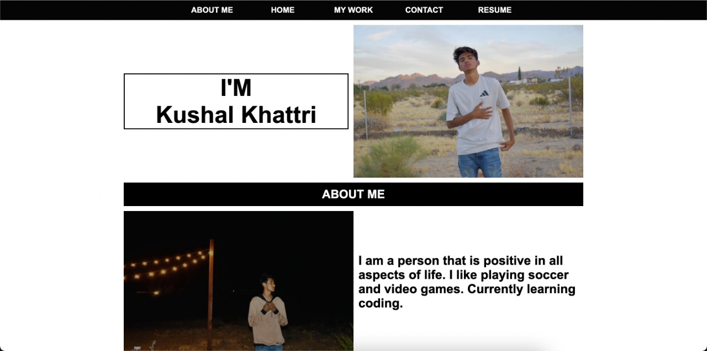
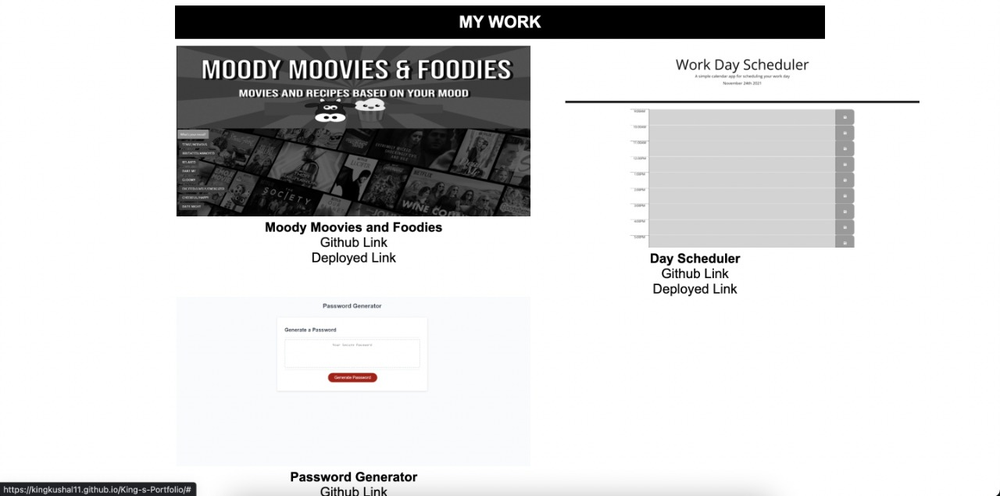
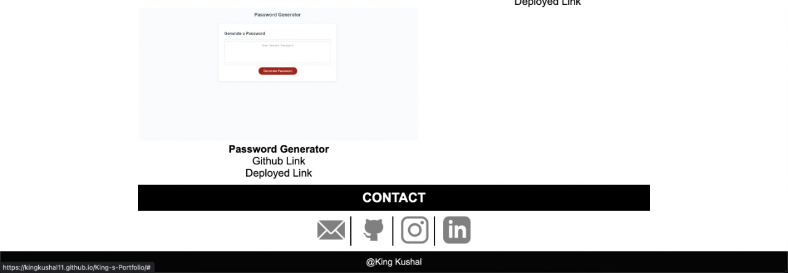

# Portfolio
 This site basically defines the portfolio and achievements. Most importantly this site defines my work and having some sort of brief introduction about me.

## Technology
This site is developed in HTML and CSS

## FAQ

#### Question 1 What information website actually gives us?

This website tells the basic information, achievements and portfolio

## Deployment

You can visit the deployed site more information

https://kingkushal11.github.io/King-s-Portfolio/
## License

[MIT](https://choosealicense.com/licenses/mit/)

## Screenshots

## Contact

For contact, email fake@fake.com or join our Slack channel.

